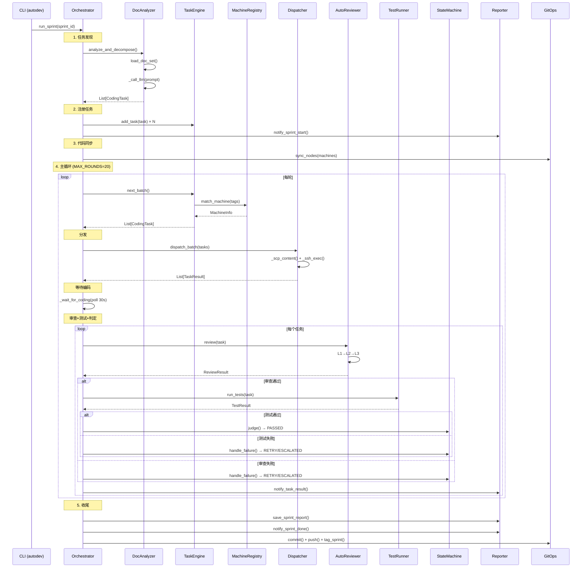
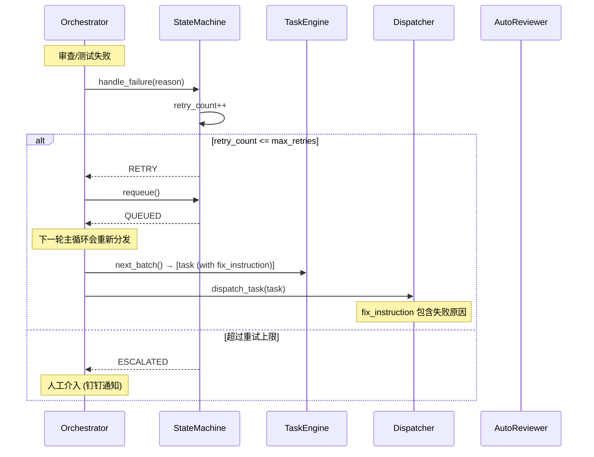
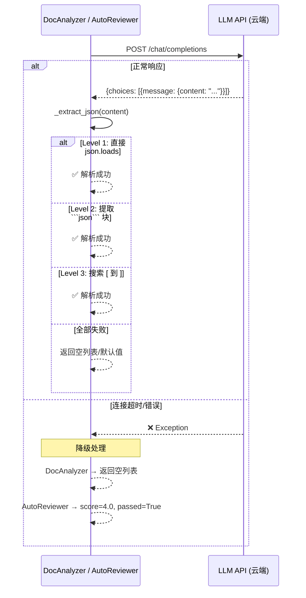

# DD-SYS-001 — 系统详细设计

> **文档编号**: DD-SYS-001  
> **版本**: v1.0  
> **状态**: 正式  
> **更新日期**: 2026-03-07  
> **上游文档**: [OD-SYS-001](../04-outline-design/OD-SYS-001-系统概要设计.md) · [OD-002](../04-outline-design/OD-002-数据模型设计.md) · [OD-003](../04-outline-design/OD-003-接口契约设计.md)  
> **下游文档**: [DD-MOD-001~013](.) · [TEST-001](../07-testing/TEST-001-测试策略与方案.md) · [TRACE-001](../06-traceability/TRACE-001-追溯矩阵.md)

---

## §1 概述

本文档基于概要设计（OD-SYS-001, OD-002, OD-003），对系统级公共设计进行详细规范。各模块的类/函数级设计见 DD-MOD-001~013。

### 1.1 详细设计文档体系

| 层次 | 文档 | 粒度 | 关注点 |
|------|------|------|--------|
| 系统概要设计 | OD-SYS-001 | 组件级 | 组件关系、调用链、FR→MOD 映射 |
| 模块概要设计 | OD-MOD-001~013 | 模块级 | 模块职责、流程概述、设计决策 |
| **系统详细设计** | **DD-SYS-001 (本文)** | **系统级** | **异常体系、日志规范、LLM 抽象、全局序列图** |
| 模块详细设计 | DD-MOD-001~013 | 类/函数级 | 内部算法、数据结构、异常处理、序列图 |

### 1.2 编号规则

- **DD-SYS-xxx**: 系统级详细设计编号
- **DD-MOD-xxx**: 对应 MOD-xxx 的模块详细设计
- **SEQ-xxx**: 序列图编号
- **ALG-xxx**: 算法描述编号
- **ERR-xxx**: 异常类型编号

---

## §2 异常层次结构

> 映射: 全局公共设计，所有模块共享

### 2.1 异常类层次

```
BaseException
└── Exception
    └── AutoDevError                     [ERR-001] 基类，所有自定义异常继承此类
        ├── ConfigError                  [ERR-002] 配置加载/解析错误
        │   ├── ConfigFileNotFound       [ERR-003] config.yaml 不存在
        │   └── ConfigKeyError           [ERR-004] 必需配置项缺失
        ├── DocError                     [ERR-005] 文档相关错误
        │   ├── DocNotFoundError         [ERR-006] 文档路径不存在
        │   └── DocParseError            [ERR-007] 文档解析失败
        ├── LLMError                     [ERR-008] LLM 调用相关错误
        │   ├── LLMConnectionError       [ERR-009] LLM API 连接失败
        │   ├── LLMResponseError         [ERR-010] LLM 返回非预期格式
        │   └── LLMTokenLimitError       [ERR-011] Token 超限
        ├── DispatchError                [ERR-012] 任务分发错误
        │   ├── SSHConnectionError       [ERR-013] SSH 连接失败
        │   └── SCPTransferError         [ERR-014] SCP 文件传输失败
        ├── StateMachineError            [ERR-015] 状态转换非法 (已实现)
        ├── ReviewError                  [ERR-016] 审查执行错误
        ├── TestError                    [ERR-017] 测试执行错误
        │   └── TestTimeoutError         [ERR-018] 测试超时
        └── GitError                     [ERR-019] Git 操作失败
```

### 2.2 当前实现状况

| ERR ID | 异常类 | 状态 | 所在模块 |
|--------|--------|------|---------|
| ERR-001 | AutoDevError | **待实现** | 建议: `orchestrator/errors.py` |
| ERR-015 | StateMachineError | **已实现** | MOD-009 (state_machine.py) |
| 其他 | — | **待实现** | 当前各模块直接使用 Python 内建异常 |

### 2.3 异常处理原则

| 原则 | 说明 |
|------|------|
| **不吞异常** | 所有 except 块必须记录日志 (至少 warning 级别) |
| **优雅降级** | LLM 调用失败 → 给默认值继续 (如 score=4.0)，不阻塞流水线 |
| **上下文传递** | 异常 message 包含: 模块名、操作名、原始错误 |
| **终态安全** | 任何未预期异常导致任务 ESCALATED，不会卡在中间态 |
| **重试可区分** | 可重试异常 (网络超时) vs 不可重试异常 (配置错误) 应明确区分 |

---

## §3 日志规范

> 映射: 全局公共设计

### 3.1 Logger 命名规范

所有模块使用 `logging.getLogger("orchestrator.{module}")` 格式:

| 模块 | Logger 名称 |
|------|------------|
| MOD-001 | `orchestrator.doc_analyzer` |
| MOD-002 | `orchestrator.doc_parser` |
| MOD-003 | `orchestrator.machine_registry` |
| MOD-004 | `orchestrator.task_engine` |
| MOD-005 | — (纯数据模型，无日志) |
| MOD-006 | `orchestrator.dispatcher` |
| MOD-007 | `orchestrator.reviewer` |
| MOD-008 | `orchestrator.test_runner` |
| MOD-009 | `orchestrator.state_machine` |
| MOD-010 | `orchestrator.reporter` |
| MOD-011 | `orchestrator.git_ops` |
| MOD-012 | — (配置加载层，使用根 logger) |
| MOD-013 | `orchestrator` (根) |

### 3.2 日志级别规范

| 级别 | 使用场景 | 示例 |
|------|---------|------|
| **DEBUG** | 内部调试信息 | `log.debug("[GitOps] git pull: %s", cmd)` |
| **INFO** | 正常业务流程 | `log.info("Sprint %s 开始, 任务数: %d", id, count)` |
| **WARNING** | 非致命异常/降级 | `log.warning("钉钉 Webhook 失败: HTTP %d", code)` |
| **ERROR** | 影响单个任务的错误 | `log.error("[GitOps] git push 异常: %s", e)` |
| **CRITICAL** | 影响整条流水线 | 暂未使用 |

### 3.3 日志格式

```python
# 由 main.py 统一配置
logging.basicConfig(
    level=level,
    format="%(asctime)s [%(levelname)s] %(name)s: %(message)s",
    datefmt="%H:%M:%S",
)
```

| 字段 | 格式 | 示例 |
|------|------|------|
| 时间 | `HH:MM:SS` | `14:32:01` |
| 级别 | `[LEVEL]` | `[INFO]` |
| 模块 | `name` | `orchestrator.dispatcher` |
| 消息 | 自由文本 | `任务 T-001 分发到 4090` |

### 3.4 结构化日志扩展 (待实现)

未来可扩展为 JSON 格式:

```json
{
  "timestamp": "2026-03-07T14:32:01",
  "level": "INFO",
  "module": "orchestrator.dispatcher",
  "task_id": "T-001",
  "machine": "4090",
  "event": "task_dispatched",
  "message": "任务 T-001 分发到 4090"
}
```

---

## §4 LLM 抽象层

> 映射: MOD-001 (DocAnalyzer), MOD-007 (AutoReviewer) 共享

### 4.1 当前实现

两个模块各自内联了 LLM 调用逻辑，存在代码重复:

| 模块 | 方法 | 温度 | max_tokens | 用途 |
|------|------|------|-----------|------|
| MOD-001 | `DocAnalyzer._call_llm()` | 0.2 | 4096 | 文档分解为任务 |
| MOD-007 | `AutoReviewer._call_llm()` | 0.1 | 2048 | 契约/设计审查 |

**共同模式**:
- httpx.AsyncClient POST 到 OpenAI-compatible API
- JSON 响应提取: `response["choices"][0]["message"]["content"]`
- 3 级 JSON 回退: 直接解析 → ` ```json``` ` 块 → `[` 到 `]` 搜索
- 超时: httpx timeout 10s~30s

### 4.2 抽象层设计 (待实现)

```
┌─────────────────────────────────────────┐
│  LLMProvider (抽象基类)                   │
│                                          │
│  + call(prompt, temperature, max_tokens) │
│      → str                               │
│  + call_json(prompt, ...) → dict/list    │
│  + parse_json_response(text) → Any       │
└──────────┬──────────────────────┬────────┘
           │                      │
   ┌───────┴───────┐     ┌───────┴────────┐
   │ OpenAIProvider │     │ LocalProvider   │
   │ (httpx async)  │     │ (ollama/vllm)  │
   └───────────────┘     └────────────────┘
```

**推荐接口设计**:

```python
class LLMProvider(ABC):
    """LLM 提供者抽象基类"""

    @abstractmethod
    async def call(
        self,
        prompt: str,
        *,
        system_prompt: str = "",
        temperature: float = 0.2,
        max_tokens: int = 4096,
    ) -> str:
        """调用 LLM，返回文本响应"""
        ...

    async def call_json(
        self,
        prompt: str,
        **kwargs,
    ) -> Any:
        """调用 LLM 并解析 JSON 响应，内置 3 级回退"""
        text = await self.call(prompt, **kwargs)
        return self._extract_json(text)

    @staticmethod
    def _extract_json(text: str) -> Any:
        """3 级 JSON 提取 (从 DocAnalyzer/AutoReviewer 提取)"""
        # Level 1: 直接 json.loads
        # Level 2: 查找 ```json``` 代码块
        # Level 3: 查找 [ 到 ] 或 { 到 }
        ...
```

### 4.3 共享参数对比

| 参数 | DocAnalyzer | AutoReviewer | 统一建议 |
|------|-----------|-------------|---------|
| API URL | `config.openai_api_base` | `config.openai_api_base` | 统一 |
| API Key | `config.openai_api_key` | `config.openai_api_key` | 统一 |
| Model | `config.aider_model` | `config.aider_model` | 统一 |
| Temperature | 0.2 | 0.1 | 调用方指定 |
| Max Tokens | 4096 | 2048 | 调用方指定 |
| Timeout | 30s | 10s | 调用方指定 |

---

## §5 全局序列图

### SEQ-001: Sprint 完整生命周期



### SEQ-002: 任务重试流程



### SEQ-003: LLM 调用与降级



---

## §6 配置驱动架构

### 6.1 配置-模块映射

| 配置路径 | 类型 | 消费模块 | 说明 |
|---------|------|---------|------|
| `project.name` | str | Reporter | 项目名称 |
| `project.path` | Path | DocAnalyzer, Config | 项目根目录 |
| `doc_set.*` | Dict | DocAnalyzer | glob 模式 → 文档类型 |
| `orchestrator.mode` | str | Main | sprint / continuous |
| `orchestrator.current_sprint` | int | Main | 当前 Sprint 编号 |
| `orchestrator.max_concurrent` | int | Main | 最大并发任务 |
| `llm.openai_api_base` | str | DocAnalyzer, Reviewer | LLM API 地址 |
| `llm.openai_api_key` | str | DocAnalyzer, Reviewer | LLM API 密钥 |
| `llm.model` | str | DocAnalyzer, Reviewer | 模型名称 |
| `task.single_task_timeout` | int | Dispatcher | 单任务超时 (秒) |
| `task.max_retries` | int | StateMachine, Main | 最大重试次数 |
| `testing.pass_threshold` | float | Reviewer | 审查通过阈值 |
| `testing.test_pass_rate_threshold` | float | TestRunner | 测试通过率阈值 |
| `notification.dingtalk_webhook` | str | Reporter | 钉钉 Webhook URL |
| `machines[]` | List | MachineRegistry | 机器配置列表 |

### 6.2 环境变量展开

```yaml
# config.yaml 中使用 ${VAR} 引用环境变量
llm:
  openai_api_key: "${OPENAI_API_KEY}"
  openai_api_base: "${LLM_API_BASE}"
```

展开算法 (`_expand_env_vars`):
1. 递归遍历 dict/list/str
2. 对 str 类型执行 `re.sub(r"\$\{(\w+)\}", replace, value)`
3. `replace` 从 `os.environ.get(var)` 取值，未找到则保留原文

---

## §7 线程安全与并发模型

### 7.1 并发模型总览

| 层次 | 并发方式 | 保护机制 |
|------|---------|---------|
| **主循环** | asyncio 单线程事件循环 | 无需锁 |
| **任务分发** | `asyncio.gather` 并行 SSH | 每个连接独立 |
| **机器注册表** | 可能被多个协程访问 | `threading.Lock` |
| **任务引擎** | 可能被多个协程访问 | `threading.Lock` |
| **Git 同步** | `asyncio.gather` 并行 SSH | 每节点独立 |

### 7.2 锁使用规范

```python
# 正确: with 语句自动释放
with self._lock:
    machine = self._machines.get(machine_id)
    return machine

# 禁止: 嵌套锁 (死锁风险)
# with self._lock:
#     with other._lock:  # ❌ 禁止
```

| 规则 | 说明 |
|------|------|
| 锁粒度最小化 | 只保护共享数据读写，不在锁内做 I/O |
| 禁止嵌套锁 | registry 锁和 engine 锁不得嵌套获取 |
| 快速释放 | 锁内操作应 O(1) 或 O(n) 小 n |

---

## §8 外部依赖清单

### 8.1 Python 包依赖

| 包 | 版本要求 | 使用模块 | 用途 |
|----|---------|---------|------|
| `httpx` | ≥0.24 | MOD-001, MOD-007, MOD-010 | 异步 HTTP 客户端 (LLM, 钉钉) |
| `pyyaml` | ≥6.0 | MOD-012 | YAML 配置解析 |
| `pytest` | ≥7.0 | MOD-008 | 测试执行 (runtime) |
| `pytest-json-report` | ≥1.5 | MOD-008 | JSON 格式测试报告 |
| `ruff` | ≥0.1 | MOD-007 | Python linting (runtime) |

### 8.2 外部服务依赖

| 服务 | 协议 | 消费模块 | 说明 |
|------|------|---------|------|
| LLM API | HTTPS (OpenAI 兼容) | MOD-001, MOD-007 | 文档分解 + 代码审查 |
| 钉钉 Webhook | HTTPS | MOD-010 | 通知推送 |
| 钉钉 OpenAPI | HTTPS | MOD-010 | 企业内部应用通知 |
| SSH | TCP:22 | MOD-006, MOD-011 | 远程机器执行 + Git 同步 |
| Git 远程仓库 | SSH/HTTPS | MOD-011 | 代码推送 |

---

## 变更记录

| 版本 | 日期 | 变更内容 | 作者 |
|------|------|---------|------|
| v1.0 | 2026-03-07 | 创建: 异常体系、日志规范、LLM 抽象、全局序列图、配置映射、并发模型、依赖清单 | AutoDev Pipeline |
