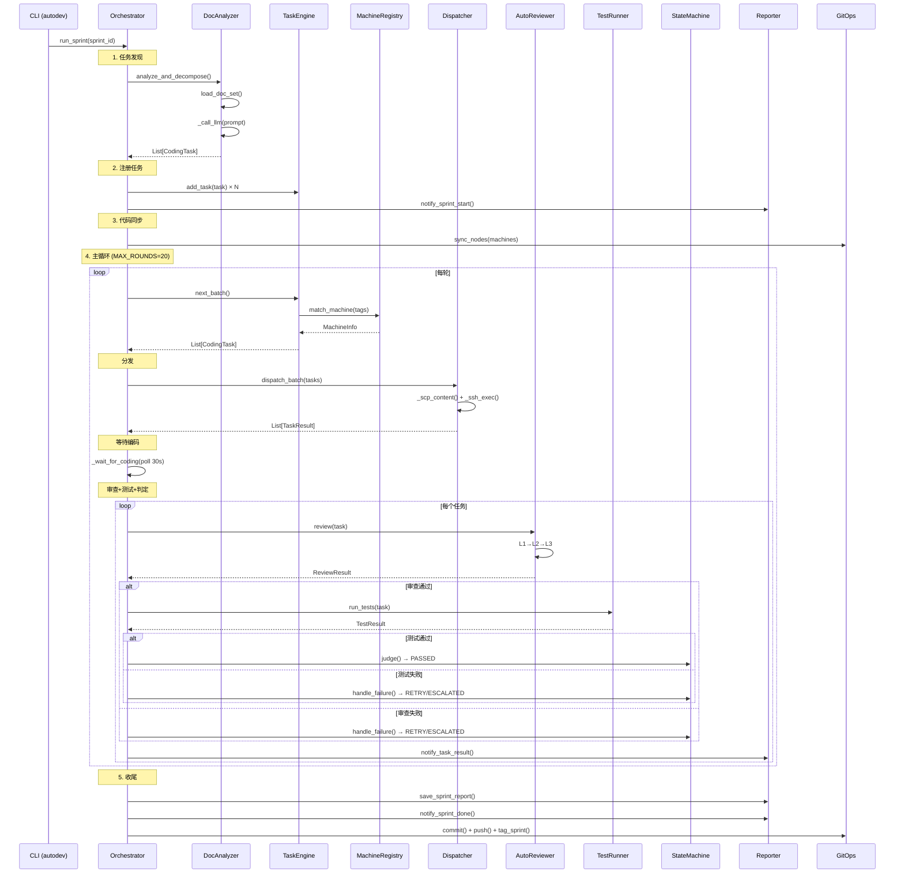
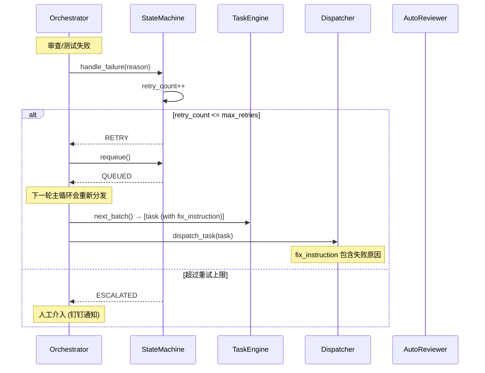
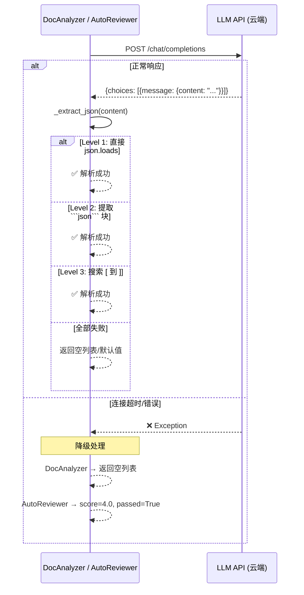

# DD-SYS-001 — 系统详细设计

> **文档编号**: DD-SYS-001  
> **版本**: v1.0  
> **状态**: 正式  
> **更新日期**: 2026-03-07  
> **上游文档**: [OD-SYS-001](../04-outline-design/OD-SYS-001-系统概要设计.md) · [OD-002](../04-outline-design/OD-002-数据模型设计.md) · [OD-003](../04-outline-design/OD-003-接口契约设计.md)  
> **下游文档**: [DD-MOD-001~013](.) · [TEST-001](../07-testing/TEST-001-测试策略与方案.md) · [TRACE-001](../06-traceability/TRACE-001-追溯矩阵.md)

---

## §1 概述

本文档基于概要设计（OD-SYS-001, OD-002, OD-003），对系统级公共设计进行详细规范。各模块的类/函数级设计见 DD-MOD-001~013。

### 1.1 详细设计文档体系

| 层次 | 文档 | 粒度 | 关注点 |
|------|------|------|--------|
| 系统概要设计 | OD-SYS-001 | 组件级 | 组件关系、调用链、FR→MOD 映射 |
| 模块概要设计 | OD-MOD-001~013 | 模块级 | 模块职责、流程概述、设计决策 |
| **系统详细设计** | **DD-SYS-001 (本文)** | **系统级** | **异常体系、日志规范、LLM 抽象、全局序列图** |
| 模块详细设计 | DD-MOD-001~013 | 类/函数级 | 内部算法、数据结构、异常处理、序列图 |

### 1.2 编号规则

- **DD-SYS-xxx**: 系统级详细设计编号
- **DD-MOD-xxx**: 对应 MOD-xxx 的模块详细设计
- **SEQ-xxx**: 序列图编号
- **ALG-xxx**: 算法描述编号
- **ERR-xxx**: 异常类型编号

---

## §2 异常层次结构

> 映射: 全局公共设计，所有模块共享

### 2.1 异常类层次

```
BaseException
└── Exception
    └── AutoDevError                     [ERR-001] 基类，所有自定义异常继承此类
        ├── ConfigError                  [ERR-002] 配置加载/解析错误
        │   ├── ConfigFileNotFound       [ERR-003] config.yaml 不存在
        │   ├── ConfigKeyError           [ERR-004] 必需配置项缺失
        │   └── ConfigSchemaError        [ERR-025] 配置 schema 校验失败 ★v1.1
        ├── DocError                     [ERR-005] 文档相关错误
        │   ├── DocNotFoundError         [ERR-006] 文档路径不存在
        │   └── DocParseError            [ERR-007] 文档解析失败
        ├── LLMError                     [ERR-008] LLM 调用相关错误
        │   ├── LLMConnectionError       [ERR-009] LLM API 连接失败
        │   ├── LLMResponseError         [ERR-010] LLM 返回非预期格式
        │   ├── LLMTokenLimitError       [ERR-011] Token 超限
        │   └── LLMRateLimitError        [ERR-026] 429 速率限制 ★v1.1
        ├── DispatchError                [ERR-012] 任务分发错误
        │   ├── SSHConnectionError       [ERR-013] SSH 连接失败
        │   └── SCPTransferError         [ERR-014] SCP 文件传输失败
        ├── StateMachineError            [ERR-015] 状态转换非法 (已实现)
        ├── DependencyCycleError         [ERR-020] 任务循环依赖 ★v1.1
        ├── ReviewError                  [ERR-016] 审查执行错误
        ├── TestError                    [ERR-017] 测试执行错误
        │   └── TestTimeoutError         [ERR-018] 测试超时
        ├── GitError                     [ERR-019] Git 操作失败
        └── OpsError                     [ERR-021] 运维场景异常 ★v1.1
            ├── DiskFullError            [ERR-022] 磁盘空间不足
            ├── OOMError                 [ERR-023] 内存溢出
            └── SSHKeyRotationError      [ERR-024] SSH 密钥轮换失败
```

### 2.2 当前实现状况

| ERR ID | 异常类 | 状态 | 所在模块 |
|--------|--------|------|---------|
| ERR-001 | AutoDevError | **待实现** | 建议: `orchestrator/errors.py` |
| ERR-015 | StateMachineError | **已实现** | MOD-009 (state_machine.py) |
| ERR-020 | DependencyCycleError | **v1.1 设计** | MOD-004 (task_engine.py), 见 ALG-009a |
| ERR-021~024 | OpsError 体系 | **v1.1 设计** | 运维场景: 磁盘/OOM/SSH 密钥轮换 |
| ERR-025 | ConfigSchemaError | **v1.1 设计** | MOD-012 (config.py), 见 §2.4 校验 |
| ERR-026 | LLMRateLimitError | **v1.1 设计** | MOD-001/MOD-008 LLM 重试, 见 §4.4 |
| 其他 | — | **待实现** | 当前各模块直接使用 Python 内建异常 |

### 2.3 运维故障场景处理 ★v1.1

> 对应 ACTION-ITEM v2.0 A-010: 5 个运维故障场景的详细处理逻辑

#### 场景 1: 磁盘空间不足 (ERR-022 DiskFullError)

| 项目 | 内容 |
|------|------|
| **触发条件** | SSH 执行返回 stderr 含 `No space left on device` 或 `ENOSPC` |
| **检测点** | Dispatcher._ssh_exec() 结果解析 |
| **处理流程** | ① 标记该机器为 OFFLINE → ② 当前任务 RETRY (迁移到其他机器) → ③ 发送钉钉告警 (含 machine_id + 磁盘使用) → ④ Orchestrator 后续不再向该机器分发 |
| **恢复条件** | 运维手动清理磁盘后，通过 API 或重启恢复机器状态为 IDLE |
| **日志级别** | ERROR |

#### 场景 2: 内存溢出 (ERR-023 OOMError)

| 项目 | 内容 |
|------|------|
| **触发条件** | SSH 进程被 OOM Killer 终止 (exit_code = -9/137) 或 stderr 含 `Killed`/`MemoryError` |
| **检测点** | Dispatcher._ssh_exec() exit_code 分析 |
| **处理流程** | ① 标记机器为 OFFLINE → ② 当前任务 RETRY → ③ 钉钉告警 (含进程被杀信息) → ④ 如果连续 2 次 OOM 则将机器从 registry 中永久排除本轮 Sprint |
| **恢复条件** | Sprint 结束后自动重置 / 运维手动恢复 |
| **日志级别** | CRITICAL |

#### 场景 3: SSH 密钥轮换失败 (ERR-024 SSHKeyRotationError)

| 项目 | 内容 |
|------|------|
| **触发条件** | SSH 连接返回 `Permission denied (publickey)` 或 `Host key verification failed` |
| **检测点** | Dispatcher._ssh_pre_check() (ALG-013a) 或 _ssh_exec() stderr |
| **处理流程** | ① 标记机器为 OFFLINE → ② 当前任务迁移 → ③ 钉钉告警 (含 host + 具体错误信息) → ④ 不自动重试 SSH 认证 (安全原因) |
| **恢复条件** | 运维更新 SSH 密钥后，手动恢复机器状态 |
| **日志级别** | ERROR |
| **安全约束** | 禁止在日志中打印密钥内容或密钥路径 |

#### 场景 4: Webhook 回退 (Reporter 降级)

| 项目 | 内容 |
|------|------|
| **触发条件** | 钉钉 Webhook 调用返回非 200 或超时 (默认 10s) |
| **检测点** | Reporter._send_dingtalk() |
| **处理流程** | ① 第 1 次失败: 重试 1 次 (间隔 2s) → ② 仍失败: 降级为仅写本地文件 `reports/webhook_fallback_{ts}.md` → ③ 记录 WARNING 日志 → ④ 不阻塞主流程 (通知是尽力而为) |
| **恢复条件** | 下次 Sprint 自动恢复正常发送 |
| **日志级别** | WARNING |
| **设计原则** | 通知系统故障不应影响核心编码流水线 |

#### 场景 5: 进程崩溃恢复 (Orchestrator Crash Recovery)

| 项目 | 内容 |
|------|------|
| **触发条件** | Orchestrator 进程意外终止 (SIGKILL、断电、Python 异常未捕获) |
| **检测点** | 下次启动时 TaskEngine.__init__() 检测 `_snapshot.json` 存在 |
| **处理流程** | ① 加载最近快照 (ALG-009c) → ② 验证快照版本和完整性 → ③ 恢复 QUEUED/DISPATCHED/RETRY 状态的任务 → ④ 已 DISPATCHED 但无结果的任务 → 标记为 RETRY → ⑤ 记录 WARNING "从快照恢复 N 个任务" → ⑥ 继续正常调度流程 |
| **快照时机** | 每次状态变更后通过 StateMachine 回调自动保存 (见 DD-MOD-004 §4.2) |
| **日志级别** | WARNING |
| **限制** | 正在远程执行中的 aider 任务可能已产出代码但未 push，需要人工检查 |

**故障检测与响应汇总表**:

| 故障 | 错误码 | 自动恢复 | 告警级别 | 影响范围 |
|------|--------|---------|---------|---------|
| 磁盘满 | ERR-022 | ✗ 需人工 | ERROR | 单机 |
| OOM | ERR-023 | ✗ 需人工 | CRITICAL | 单机 |
| SSH 密钥 | ERR-024 | ✗ 需人工 | ERROR | 单机 |
| Webhook | — | ✓ 自动降级 | WARNING | 仅通知 |
| 进程崩溃 | — | ✓ 快照恢复 | WARNING | 全局 |

### 2.4 异常处理原则

| 原则 | 说明 |
|------|------|
| **不吞异常** | 所有 except 块必须记录日志 (至少 warning 级别) |
| **优雅降级** | LLM 调用失败 → 给默认值继续 (如 score=3.5)，不阻塞流水线 ★v1.1: 4.0→3.5 |
| **上下文传递** | 异常 message 包含: 模块名、操作名、原始错误 |
| **终态安全** | 任何未预期异常导致任务 ESCALATED，不会卡在中间态 |
| **重试可区分** | 可重试异常 (网络超时) vs 不可重试异常 (配置错误) 应明确区分 |

---

## §3 日志规范

> 映射: 全局公共设计

### 3.1 Logger 命名规范

所有模块使用 `logging.getLogger("orchestrator.{module}")` 格式:

| 模块 | Logger 名称 |
|------|------------|
| MOD-001 | `orchestrator.doc_analyzer` |
| MOD-002 | `orchestrator.doc_parser` |
| MOD-003 | `orchestrator.machine_registry` |
| MOD-004 | `orchestrator.task_engine` |
| MOD-005 | — (纯数据模型，无日志) |
| MOD-006 | `orchestrator.dispatcher` |
| MOD-007 | `orchestrator.reviewer` |
| MOD-008 | `orchestrator.test_runner` |
| MOD-009 | `orchestrator.state_machine` |
| MOD-010 | `orchestrator.reporter` |
| MOD-011 | `orchestrator.git_ops` |
| MOD-012 | — (配置加载层，使用根 logger) |
| MOD-013 | `orchestrator` (根) |

### 3.2 日志级别规范

| 级别 | 使用场景 | 示例 |
|------|---------|------|
| **DEBUG** | 内部调试信息 | `log.debug("[GitOps] git pull: %s", cmd)` |
| **INFO** | 正常业务流程 | `log.info("Sprint %s 开始, 任务数: %d", id, count)` |
| **WARNING** | 非致命异常/降级 | `log.warning("钉钉 Webhook 失败: HTTP %d", code)` |
| **ERROR** | 影响单个任务的错误 | `log.error("[GitOps] git push 异常: %s", e)` |
| **CRITICAL** | 影响整条流水线 | 暂未使用 |

### 3.3 日志格式

```python
# 由 main.py 统一配置
logging.basicConfig(
    level=level,
    format="%(asctime)s [%(levelname)s] %(name)s: %(message)s",
    datefmt="%H:%M:%S",
)
```

| 字段 | 格式 | 示例 |
|------|------|------|
| 时间 | `HH:MM:SS` | `14:32:01` |
| 级别 | `[LEVEL]` | `[INFO]` |
| 模块 | `name` | `orchestrator.dispatcher` |
| 消息 | 自由文本 | `任务 T-001 分发到 4090` |

### 3.4 结构化日志设计 ★v1.2

> 对应 ACTION-ITEM v2.1 A-122 / v2.0 A-011 / v1.0 A-018: JSON 结构化日志

当前 §3.3 的文本格式日志适合人工阅读，但不利于 ELK/Loki 等日志分析平台聚合检索。设计 JSON 结构化日志作为可选输出模式。

#### 启用方式

```yaml
# config.yaml
logging:
  level: "INFO"
  format: "json"          # ★v1.2: "text" (默认, 当前行为) | "json" (结构化)
  json_file: "logs/orchestrator.jsonl"   # JSON 日志落盘路径 (可选)
```

#### JSON 日志 Schema

```json
{
  "ts": "2026-03-07T14:32:01.123Z",
  "level": "INFO",
  "logger": "orchestrator.dispatcher",
  "msg": "任务 T-001 分发到 4090",
  "task_id": "T-001",
  "machine_id": "4090",
  "sprint_id": "sprint-001",
  "event": "task_dispatched",
  "duration_ms": null,
  "extra": {}
}
```

**字段规范**:

| 字段 | 类型 | 必填 | 说明 |
|------|------|------|------|
| `ts` | ISO8601 | ✅ | UTC 时间戳, 毫秒精度 |
| `level` | str | ✅ | DEBUG / INFO / WARNING / ERROR / CRITICAL |
| `logger` | str | ✅ | Logger 名称 (§3.1 命名规范) |
| `msg` | str | ✅ | 可读消息 (经过脱敏 §3.5) |
| `task_id` | str | ❌ | 当前任务 ID (上下文注入) |
| `machine_id` | str | ❌ | 当前机器 ID |
| `sprint_id` | str | ❌ | 当前 Sprint ID |
| `event` | str | ❌ | 结构化事件名 (见下表) |
| `duration_ms` | int | ❌ | 操作耗时 (毫秒) |
| `extra` | dict | ❌ | 自定义扩展字段 |

**标准 event 名称**:

| event | 触发点 | 级别 |
|-------|--------|------|
| `sprint_start` | Orchestrator 启动 Sprint | INFO |
| `sprint_done` | Sprint 完成 | INFO |
| `task_dispatched` | Dispatcher 分发任务 | INFO |
| `task_completed` | 任务编码完成 | INFO |
| `review_passed` | 审查通过 | INFO |
| `review_failed` | 审查失败 | WARNING |
| `test_passed` | 测试通过 | INFO |
| `test_failed` | 测试失败 | WARNING |
| `llm_call` | LLM API 调用 | DEBUG |
| `llm_retry` | LLM 重试 | WARNING |
| `llm_degraded` | LLM 降级兜底 | WARNING |
| `ssh_pre_check_fail` | SSH 预检失败 | WARNING |
| `machine_offline` | 机器下线 | ERROR |
| `snapshot_saved` | 状态快照保存 | DEBUG |
| `crash_recovery` | 崩溃恢复 | WARNING |

#### 实现方案: loguru serialize

推荐使用 `loguru` 库替代 stdlib logging，利用其内置 `serialize=True` 输出 JSON:

```python
from loguru import logger

# JSON 结构化输出 (落盘)
logger.add(
    "logs/orchestrator.jsonl",
    serialize=True,
    rotation="50 MB",
    retention="30 days",
    level=config.log_level,
    filter=SanitizeFilter()   # §3.5 脱敏过滤器
)

# 控制台文本输出 (保留人类可读)
logger.add(
    sys.stderr,
    format="{time:HH:mm:ss} [{level}] {name}: {message}",
    level=config.log_level,
)
```

**loguru 选择理由**: 原生支持 `serialize`、rotation、结构化上下文注入 (`logger.bind(task_id=xx)`)，对比 stdlib `json` formatter 方案开发量更低。

#### 上下文注入

```python
# 任务作用域: 自动注入 task_id + machine_id
with logger.contextualize(task_id=task.task_id, machine_id=machine.machine_id):
    logger.info("分发到 {machine}", machine=machine.machine_id,
                event="task_dispatched")
```

### 3.5 敏感信息脱敏 ★v1.2

> 对应 ACTION-ITEM v2.1 A-127: 防止 API Key、Token 等敏感信息泄漏到日志

#### 脱敏规则

| 模式 | 正则 | 替换为 | 说明 |
|------|------|--------|------|
| API Key | `(api[_-]?key\s*[:=]\s*)(["']?)[A-Za-z0-9\-_]{8,}\2` | `\1\2***MASKED***\2` | 匹配 api_key=xxx 格式 |
| Bearer Token | `(Bearer\s+)[A-Za-z0-9\-_.]+` | `\1***MASKED***` | HTTP Authorization 头 |
| SSH 密钥路径 | `(/[\w./]+/\.ssh/[\w.]+)` | `***SSH_KEY_PATH***` | 禁止暴露密钥文件位置 |
| access_token | `(access[_-]?token\s*[:=]\s*)(["']?)[A-Za-z0-9\-_]{8,}\2` | `\1\2***MASKED***\2` | OAuth/Webhook token |
| 钉钉 Secret | `(SEC[a-f0-9]{32,})` | `SEC***MASKED***` | 钉钉签名密钥 |

#### 实现设计

```python
import re

class LogSanitizer:
    """日志敏感信息脱敏过滤器"""
    
    PATTERNS = [
        (re.compile(r'(api[_-]?key\s*[:=]\s*["\']?)[A-Za-z0-9\-_]{8,}', re.I),
         r'\1***MASKED***'),
        (re.compile(r'(Bearer\s+)[A-Za-z0-9\-_.]+', re.I),
         r'\1***MASKED***'),
        (re.compile(r'(access[_-]?token\s*[:=]\s*["\']?)[A-Za-z0-9\-_]{8,}', re.I),
         r'\1***MASKED***'),
        (re.compile(r'SEC[a-f0-9]{32,}'),
         'SEC***MASKED***'),
    ]
    
    @classmethod
    def sanitize(cls, message: str) -> str:
        for pattern, replacement in cls.PATTERNS:
            message = pattern.sub(replacement, message)
        return message
```

**集成方式**: 作为 `logging.Filter` 注入到根 Logger，所有模块日志自动过滤:
```python
class SanitizeFilter(logging.Filter):
    def filter(self, record):
        record.msg = LogSanitizer.sanitize(str(record.msg))
        return True
```

**适用范围**:
- 所有 `orchestrator.*` Logger 的 Handler 均安装此 Filter
- 特别关注: Dispatcher SSH 脚本构建 (含 API Key)、Reporter 钉钉 Webhook (含 Secret)
- LLM 审计日志 (DD-MOD-001 §2.5a) 的 prompt_preview 也经过脱敏

---

## §4 LLM 抽象层

> 映射: MOD-001 (DocAnalyzer), MOD-007 (AutoReviewer) 共享

### 4.1 当前实现

两个模块各自内联了 LLM 调用逻辑，存在代码重复:

| 模块 | 方法 | 温度 | max_tokens | 用途 |
|------|------|------|-----------|------|
| MOD-001 | `DocAnalyzer._call_llm()` | 0.2 | 4096 | 文档分解为任务 |
| MOD-007 | `AutoReviewer._call_llm()` | 0.1 | 2048 | 契约/设计审查 |

**共同模式**:
- httpx.AsyncClient POST 到 OpenAI-compatible API
- JSON 响应提取: `response["choices"][0]["message"]["content"]`
- 3 级 JSON 回退: 直接解析 → ` ```json``` ` 块 → `[` 到 `]` 搜索
- 超时: httpx timeout 10s~30s

### 4.2 抽象层设计 ★v1.2

> 对应 ACTION-ITEM v1.0 A-017: 核心模块 Protocol/ABC 接口定义

#### LLMProvider ABC

```
┌─────────────────────────────────────────┐
│  LLMProvider (抽象基类)                   │
│                                          │
│  + call(prompt, temperature, max_tokens) │
│      → str                               │
│  + call_json(prompt, ...) → dict/list    │
│  + parse_json_response(text) → Any       │
└──────────┬──────────────────────┬────────┘
           │                      │
   ┌───────┴───────┐     ┌───────┴────────┐
   │ OpenAIProvider │     │ LocalProvider   │
   │ (httpx async)  │     │ (ollama/vllm)  │
   └───────────────┘     └────────────────┘
```

**推荐接口设计**:

```python
from abc import ABC, abstractmethod

class LLMProvider(ABC):
    """LLM 提供者抽象基类"""

    @abstractmethod
    async def call(
        self,
        prompt: str,
        *,
        system_prompt: str = "",
        temperature: float = 0.2,
        max_tokens: int = 4096,
    ) -> str:
        """调用 LLM，返回文本响应"""
        ...

    async def call_json(
        self,
        prompt: str,
        **kwargs,
    ) -> Any:
        """调用 LLM 并解析 JSON 响应，内置 3 级回退"""
        text = await self.call(prompt, **kwargs)
        return self._extract_json(text)

    @staticmethod
    def _extract_json(text: str) -> Any:
        """3 级 JSON 提取 (从 DocAnalyzer/AutoReviewer 提取)"""
        # Level 1: 直接 json.loads
        # Level 2: 查找 ```json``` 代码块
        # Level 3: 查找 [ 到 ] 或 { 到 }
        ...
```

#### DispatcherProtocol

```python
from typing import Protocol, runtime_checkable

@runtime_checkable
class DispatcherProtocol(Protocol):
    """任务分发器协议 — Orchestrator 依赖此协议而非 Dispatcher 具体实现"""
    
    async def dispatch_task(self, task: CodingTask) -> TaskResult: ...
    async def dispatch_batch(self, tasks: list[CodingTask]) -> list[TaskResult]: ...
```

#### ReviewerProtocol

```python
@runtime_checkable
class ReviewerProtocol(Protocol):
    """代码审查器协议 — 支持替换为不同审查策略"""
    
    async def review_task(self, task: CodingTask, result: TaskResult) -> ReviewResult: ...
```

#### TestRunnerProtocol

```python
@runtime_checkable
class TestRunnerProtocol(Protocol):
    """测试执行器协议"""
    
    async def run_tests(self, task: CodingTask, result: TaskResult) -> TestResult: ...
```

#### ReporterProtocol

```python
@runtime_checkable
class ReporterProtocol(Protocol):
    """报告与通知协议"""
    
    async def notify_sprint_start(self, sprint_id: str, task_count: int) -> None: ...
    async def notify_task_result(self, task: CodingTask, passed: bool) -> None: ...
    async def save_sprint_report(self, results: dict) -> str: ...
```

**Protocol vs ABC 选择**:

| 维度 | Protocol (推荐) | ABC |
|------|---------|-----|
| 注册方式 | 结构化子类型 ("鸭子类型") | 显式继承 |
| 运行时检查 | `isinstance()` (需 `@runtime_checkable`) | `isinstance()` |
| 依赖方向 | 消费方定义, 提供方无需感知 | 提供方必须显式继承 |
| 适用场景 | Orchestrator ↔ 各模块的松耦合 | LLMProvider 需共享默认实现 |

**设计决策**: 
- **LLMProvider** 使用 ABC (需共享 `call_json` / `_extract_json` 默认实现)
- **Dispatcher/Reviewer/TestRunner/Reporter** 使用 Protocol (松耦合, 便于测试 mock)

### 4.5 LLM 速率限制 (Token Bucket) ★v1.2

> 对应 ACTION-ITEM v1.0 A-020: 防止并发 LLM 调用超过 API 限额

#### 设计背景

DocAnalyzer (1 次/Sprint) 和 AutoReviewer (2 次/任务 × 并发数) 共享同一 LLM API Key。当 `max_concurrent=5` 时，最坏情况下可能有 10+ 并发 LLM 请求，触发 429 速率限制。

#### Token Bucket 算法

```python
import asyncio
import time

class TokenBucketRateLimiter:
    """
    令牌桶限速器 — 控制 LLM API 调用频率。
    线程安全 (基于 asyncio.Lock)。
    """
    
    def __init__(self, rate: float = 10.0, burst: int = 15):
        """
        Args:
            rate:  每秒补充令牌数 (对应 API RPM/60)
            burst: 桶容量 (允许瞬时突发)
        """
        self._rate = rate
        self._burst = burst
        self._tokens = float(burst)
        self._last_refill = time.monotonic()
        self._lock = asyncio.Lock()
    
    async def acquire(self, tokens: int = 1) -> float:
        """
        获取令牌。如果令牌不足，等待直到有足够令牌。
        返回实际等待时间 (秒)。
        """
        async with self._lock:
            self._refill()
            
            if self._tokens >= tokens:
                self._tokens -= tokens
                return 0.0
            
            # 计算等待时间
            deficit = tokens - self._tokens
            wait_time = deficit / self._rate
            self._tokens = 0
        
        # 在锁外等待 (不阻塞其他协程查询令牌)
        await asyncio.sleep(wait_time)
        
        async with self._lock:
            self._refill()
            self._tokens -= tokens
        
        return wait_time
    
    def _refill(self):
        now = time.monotonic()
        elapsed = now - self._last_refill
        self._tokens = min(self._burst, self._tokens + elapsed * self._rate)
        self._last_refill = now
```

#### 配置

```yaml
# config.yaml
llm:
  rate_limit:
    enabled: true             # 默认 false
    requests_per_second: 10   # 每秒最大请求数 (对应 RPM 600)
    burst: 15                 # 突发容量
```

#### 集成位置

Token Bucket 实例在 Config 加载时创建，通过 LLMProvider 的 `call()` 方法自动 `acquire()`:

```
DocAnalyzer._call_llm()    ──┐
                              ├── LLMProvider.call() → rate_limiter.acquire() → HTTP POST
AutoReviewer._call_llm()   ──┘
```

**与重试策略 (§4.4) 的配合**: 
- `acquire()` 在发送 HTTP 请求**之前**执行
- 如果收到 429 响应，重试逻辑 (ALG-005) 仍然生效，但 Token Bucket 会自然降低后续请求频率
- 429 的 `Retry-After` 头不会覆盖 Token Bucket 的等待时间 — 两者取 max

### 4.3 共享参数对比

| 参数 | DocAnalyzer | AutoReviewer | 统一建议 |
|------|-----------|-------------|---------|
| API URL | `config.openai_api_base` | `config.openai_api_base` | 统一 |
| API Key | `config.openai_api_key` | `config.openai_api_key` | 统一 |
| Model | `config.aider_model` | `config.aider_model` | 统一 |
| Temperature | 0.2 | 0.1 | 调用方指定 |
| Max Tokens | 4096 | 2048 | 调用方指定 |
| Timeout | 30s | 10s | 调用方指定 |

### 4.4 LLM 重试策略 ★v1.1

> 对应 ACTION-ITEM v2.1 A-102: 两个模块共享相同的重试逻辑

#### 统一重试参数

| 参数 | 值 | 说明 |
|------|-----|------|
| MAX_RETRIES | 3 | 最大重试次数 (含首次) |
| BACKOFF_BASE | 1s | 退避基数 |
| 退避序列 | 1s → 2s → 4s | `base × 2^(attempt-1)` |
| 429 处理 | 优先 `Retry-After` 头 | 服务端指定的等待时间优先 |

#### 可重试 vs 不可重试

| 错误类型 | 重试? | 对应 ERR |
|---------|-------|---------|
| HTTP 429 (速率限制) | ✅ | ERR-026 LLMRateLimitError |
| HTTP 5xx (服务端错误) | ✅ | ERR-009 LLMConnectionError |
| 连接超时 / 网络断开 | ✅ | ERR-009 LLMConnectionError |
| HTTP 4xx (非429, 如 401/403) | ❌ | ERR-010 LLMResponseError |
| JSON 解析失败 | ❌ | ERR-010 LLMResponseError |

#### 降级兜底

当 3 次重试耗尽后:
- **DocAnalyzer**: `analyze_and_decompose()` catch `LLMConnectionError` → 返回 `[]` (无任务), 上游 `_discover_tasks()` fallback 到 v2 DocParser
- **AutoReviewer L2**: catch → `(True, "L2 降级跳过")`, 不阻塞流水线
- **AutoReviewer L3**: catch → `(3.5, "L3 降级: 待人工审查")`, 边界通过但标记降级

> **v1.1 变更**: L3 降级分从 4.0 改为 3.5 (= `review_threshold`)。原 4.0 导致降级审查静默通过，人工无感知。3.5 = threshold 使其刚好通过但在报告中标记为「降级通过」。

---

## §5 全局序列图

### SEQ-SYS-001: Sprint 完整生命周期



### SEQ-SYS-002: 任务重试流程



### SEQ-SYS-003: LLM 调用与降级



---

## §6 配置驱动架构

### 6.1 配置-模块映射

| 配置路径 | 类型 | 消费模块 | 说明 |
|---------|------|---------|------|
| `project.name` | str | Reporter | 项目名称 |
| `project.path` | Path | DocAnalyzer, Config | 项目根目录 |
| `doc_set.*` | Dict | DocAnalyzer | glob 模式 → 文档类型 |
| `orchestrator.mode` | str | Main | sprint / continuous |
| `orchestrator.current_sprint` | int | Main | 当前 Sprint 编号 |
| `orchestrator.max_concurrent` | int | Main | 最大并发任务 |
| `llm.openai_api_base` | str | DocAnalyzer, Reviewer | LLM API 地址 |
| `llm.openai_api_key` | str | DocAnalyzer, Reviewer | LLM API 密钥 |
| `llm.model` | str | DocAnalyzer, Reviewer | 模型名称 |
| `task.single_task_timeout` | int | Dispatcher | 单任务超时 (秒) |
| `task.max_retries` | int | StateMachine, Main | 最大重试次数 |
| `testing.pass_threshold` | float | Reviewer | 审查通过阈值 |
| `testing.test_pass_rate_threshold` | float | TestRunner | 测试通过率阈值 |
| `notification.dingtalk_webhook` | str | Reporter | 钉钉 Webhook URL |
| `machines[]` | List | MachineRegistry | 机器配置列表 |

### 6.2 环境变量展开

```yaml
# config.yaml 中使用 ${VAR} 引用环境变量
llm:
  openai_api_key: "${OPENAI_API_KEY}"
  openai_api_base: "${LLM_API_BASE}"
```

展开算法 (`_expand_env_vars`):
1. 递归遍历 dict/list/str
2. 对 str 类型执行 `re.sub(r"\$\{(\w+)\}", replace, value)`
3. `replace` 从 `os.environ.get(var)` 取值，未找到则保留原文

---

## §7 线程安全与并发模型

### 7.1 并发模型总览

| 层次 | 并发方式 | 保护机制 |
|------|---------|---------|
| **主循环** | asyncio 单线程事件循环 | 无需锁 |
| **任务分发** | `asyncio.gather` 并行 SSH | 每个连接独立 |
| **机器注册表** | 可能被多个协程访问 | `threading.Lock` |
| **任务引擎** | 可能被多个协程访问 | `threading.Lock` |
| **Git 同步** | `asyncio.gather` 并行 SSH | 每节点独立 |

### 7.2 锁使用规范

```python
# 正确: with 语句自动释放
with self._lock:
    machine = self._machines.get(machine_id)
    return machine

# 禁止: 嵌套锁 (死锁风险)
# with self._lock:
#     with other._lock:  # ❌ 禁止
```

| 规则 | 说明 |
|------|------|
| 锁粒度最小化 | 只保护共享数据读写，不在锁内做 I/O |
| 禁止嵌套锁 | registry 锁和 engine 锁不得嵌套获取 |
| 快速释放 | 锁内操作应 O(1) 或 O(n) 小 n |

---

## §8 外部依赖清单

### 8.1 Python 包依赖

| 包 | 版本要求 | 使用模块 | 用途 |
|----|---------|---------|------|
| `httpx` | ≥0.24 | MOD-001, MOD-007, MOD-010 | 异步 HTTP 客户端 (LLM, 钉钉) |
| `pyyaml` | ≥6.0 | MOD-012 | YAML 配置解析 |
| `pytest` | ≥7.0 | MOD-008 | 测试执行 (runtime) |
| `pytest-json-report` | ≥1.5 | MOD-008 | JSON 格式测试报告 |
| `ruff` | ≥0.1 | MOD-007 | Python linting (runtime) |

### 8.2 外部服务依赖

| 服务 | 协议 | 消费模块 | 说明 |
|------|------|---------|------|
| LLM API | HTTPS (OpenAI 兼容) | MOD-001, MOD-007 | 文档分解 + 代码审查 |
| 钉钉 Webhook | HTTPS | MOD-010 | 通知推送 |
| 钉钉 OpenAPI | HTTPS | MOD-010 | 企业内部应用通知 |
| SSH | TCP:22 | MOD-006, MOD-011 | 远程机器执行 + Git 同步 |
| Git 远程仓库 | SSH/HTTPS | MOD-011 | 代码推送 |

---

## §9 可观测性与监控 ★v1.2

> 对应 ACTION-ITEM v2.1 A-123 / v2.0 A-012 / v1.0 A-021: Prometheus 监控指标

### 9.1 指标体系设计

采用 Prometheus 指标规范 (prometheus_client)，通过内嵌 HTTP `/metrics` 端点暴露。

#### Counter (计数器)

| 指标名 | 标签 | 说明 |
|--------|------|------|
| `autodev_tasks_total` | `status={passed,failed,escalated,retry}` | 任务数统计 |
| `autodev_llm_calls_total` | `module={doc_analyzer,reviewer_l2,reviewer_l3}`, `status={success,retry,error}` | LLM 调用次数 |
| `autodev_ssh_commands_total` | `machine_id`, `status={success,timeout,error}` | SSH 执行次数 |
| `autodev_git_pushes_total` | `machine_id`, `status={success,conflict,error}` | Git push 次数 |
| `autodev_reviews_total` | `layer={L1,L2,L3}`, `result={pass,fail,degraded}` | 审查结果统计 |

#### Histogram (直方图)

| 指标名 | 标签 | Buckets | 说明 |
|--------|------|---------|------|
| `autodev_task_duration_seconds` | `status` | 30, 60, 120, 300, 600, 1200 | 任务执行耗时 |
| `autodev_llm_latency_seconds` | `module` | 1, 2, 5, 10, 30, 60, 120 | LLM 响应延迟 |
| `autodev_review_score` | `layer` | 0.5, 1.0, 1.5, 2.0, 2.5, 3.0, 3.5, 4.0, 4.5, 5.0 | 审查评分分布 |

#### Gauge (仪表盘)

| 指标名 | 标签 | 说明 |
|--------|------|------|
| `autodev_machines_status` | `machine_id`, `status={online,busy,offline,error}` | 机器状态 |
| `autodev_active_tasks` | — | 当前并行执行中的任务数 |
| `autodev_queue_size` | — | 等待分发的任务队列深度 |
| `autodev_sprint_progress_ratio` | — | Sprint 完成比 (0.0~1.0) |

### 9.2 Metrics 端点

```python
from prometheus_client import start_http_server, Counter, Histogram, Gauge

# 在 Orchestrator 启动时暴露
start_http_server(port=config.get("metrics.port", 9090))
```

**配置**:
```yaml
# config.yaml
metrics:
  enabled: true             # 默认 false, 需显式开启
  port: 9090                # Prometheus scrape 端口
  path: "/metrics"          # 端点路径
```

### 9.3 告警规则建议 (Grafana / Alertmanager)

| 告警规则 | 条件 | 严重级别 |
|---------|------|---------|
| LLM 错误率过高 | `rate(autodev_llm_calls_total{status="error"}[5m]) > 0.3` | WARNING |
| 任务超时率过高 | `rate(autodev_ssh_commands_total{status="timeout"}[10m]) > 0.2` | WARNING |
| 所有机器离线 | `autodev_machines_status{status="online"} == 0` | CRITICAL |
| Sprint 进度停滞 | `autodev_sprint_progress_ratio` 30min 无变化 | WARNING |
| Git push 冲突频繁 | `rate(autodev_git_pushes_total{status="conflict"}[10m]) > 0.5` | WARNING |

---

## §10 状态持久化层 ★v1.2

> 对应 ACTION-ITEM: v1.0 A-016 — "实现状态持久化层 (基于 A-006 选型)"
> 详细快照设计见: DD-MOD-004 §4.2 (ALG-009b 保存 / ALG-009c 恢复)

### 10.1 持久化架构总览

```
┌─────────────────────────────────────────────┐
│              TaskEngine (MOD-004)            │
│                                              │
│  状态变更 → _save_snapshot() ─┐              │
│  启动恢复 ← _load_snapshot() ←┤              │
│                                │              │
│  ┌─────────────────────────────▼────────┐    │
│  │     PersistenceAdapter (接口)         │    │
│  │  save(snapshot: dict) → None         │    │
│  │  load() → Optional[dict]            │    │
│  └──────┬───────────────┬───────────────┘    │
│         │               │                    │
│  ┌──────▼─────┐  ┌──────▼──────┐             │
│  │ JSONFile   │  │  SQLite     │             │
│  │ Adapter    │  │  Adapter    │             │
│  │ (Phase 1)  │  │  (Phase 2)  │             │
│  └────────────┘  └─────────────┘             │
└──────────────────────────────────────────────┘
```

### 10.2 Phase 1: JSON 文件持久化 (当前)

| 属性 | 说明 |
|------|------|
| **存储格式** | 单文件 JSON ({reports_dir}/state_snapshot.json) |
| **写入时机** | 每次任务状态变更 (StateMachine callback) |
| **读取时机** | TaskEngine.__init__ / Orchestrator 启动 |
| **原子写入** | 先写 `.tmp` → `os.replace()` 原子重命名 |
| **容量上限** | ≤100 任务 (单文件约 50KB) |
| **恢复策略** | 启动时自动检测并加载；DISPATCHED 状态任务标记为 RETRY |
| **详细算法** | DD-MOD-004 ALG-009b (保存), ALG-009c (恢复) |

### 10.3 快照一致性保障

| 机制 | 说明 |
|------|------|
| 原子写 | `write → .tmp` → `os.replace()` 避免半写损坏 |
| 版本号 | `"version": "1.0"` 兼容性检查 |
| 校验和 | 恢复时检查 JSON parse 是否成功 |
| 降级 | 快照损坏 → 日志 WARNING → 全新 Sprint (不恢复) |
| 线程安全 | 写入在 `_lock` 保护下进行 (DD-MOD-004 §2) |

### 10.4 Phase 2 演进: SQLite (P3 规划)

> 当任务数 > 100 或需要支持多 Sprint 历史查询时迁移

| 属性 | 说明 |
|------|------|
| **存储** | `{reports_dir}/autodev.db` (SQLite 3) |
| **表设计** | `sprints`, `tasks`, `task_results`, `review_results` |
| **写入** | WAL 模式，单写多读 |
| **迁移** | 自动检测 JSON→SQLite 迁移 |
| **查询** | 支持历史 Sprint 对比、任务统计 |
| **触发条件** | `config.persistence.backend: "sqlite"` |

### 10.5 设计决策

| 决策 | 选择 | 备选 | 理由 |
|------|------|------|------|
| Phase 1 存储 | JSON 文件 | SQLite, Redis | 零依赖、人可读、调试友好 |
| 写入频率 | 每次状态变更 | 批量 / 定时 | 状态变更频率低 (秒级)，IO 开销可忽略 |
| 原子性 | os.replace | fsync + rename | Python os.replace 在 POSIX 上原子 |
| 恢复策略 | DISPATCHED→RETRY | 全量重放 | 简单可靠，远程可能已产出代码 |

---

## 变更记录

| 版本 | 日期 | 变更内容 | 作者 |
|------|------|---------|------|
| v1.0 | 2026-03-07 | 创建: 异常体系、日志规范、LLM 抽象、全局序列图、配置映射、并发模型、依赖清单 | AutoDev Pipeline |
| v1.1 | 2026-03-07 | SEQ-001~003 重命名为 SEQ-SYS-001~003，消除与模块级 SEQ 编号碰撞 | AutoDev Pipeline |
| v1.2 | 2026-03-07 | §3.4 JSON 结构化日志完整设计 (A-122); §3.5 敏感信息脱敏 (A-127); §4.2 Protocol/ABC 接口定义 (A-017); §4.5 Token Bucket 速率限制 (A-020); §9 Prometheus 监控指标 (A-123); §10 状态持久化层架构 (A-016) | AutoDev Pipeline |
