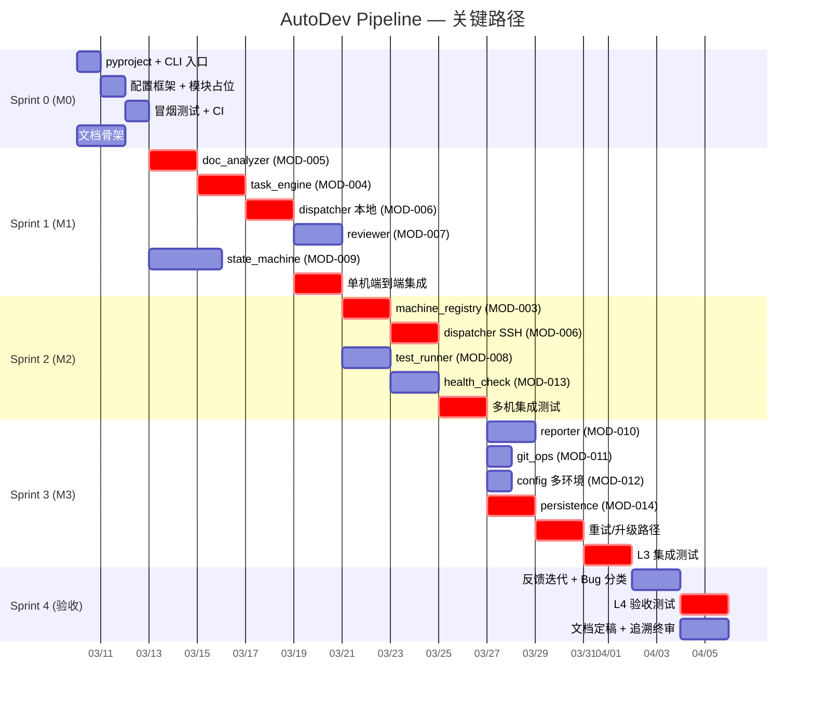

# ITER-001 — 迭代计划

> **文档编号**: ITER-001  
> **版本**: v2.0  
> **更新日期**: 2026-03-21  
> **v2.0 变更**: Sprint 3 状态更新 — 标记 Sprint 0~3 Backlog 状态  
> **上游**: [REQ-001](../01-requirements/REQ-001-系统需求规格说明书.md) · [ARCH-002](../03-architecture/ARCH-002-部署架构.md)

---

## §1 里程碑定义

| 里程碑 | 目标 | 交付物 | 判定标准 |
|--------|------|--------|---------|
| **M0 — 骨架可运行** | CLI 可调用，空 Sprint 跑通 | orchestrator v3.0 + 全模块导入 + 冒烟测试 | TC-001~005 全 pass |
| **M1 — 单机端到端** | 单台 orchestrator 本地完成 1 个 Sprint | doc_analyzer → task_engine → dispatcher(local) → reviewer → test_runner → reporter | TC-110 pass (mock LLM) |
| **M2 — 多机分发** | 5 台机器并行分发 + SSH | dispatcher remote + machine_registry + git sync | TC-060~063, TC-102 pass |
| **M3 — 生产就绪** | 全链路 + 重试/升级 + 钉钉通知 | 全部 L3 集成测试 + L4 验收 | TC-120~123 pass |

## §2 Sprint 节奏

| Sprint | 持续时间 | 聚焦模块 | 对应里程碑 |
|--------|---------|---------|-----------|
| Sprint 0 | 1 周 | 项目骨架 + CI + 文档体系 | M0 |
| Sprint 1 | 2 周 | MOD-001,004,005,006,007 | M1 |
| Sprint 2 | 2 周 | MOD-003,008 + SSH 分发 | M2 |
| Sprint 3 | 2 周 | MOD-009,010,011,012 | M3 |
| Sprint 4 | 1 周 | 全链路验收 + 文档定稿 | M3 验收 |

## §3 风险时间缓冲

每个 Sprint 末留 **1 天缓冲**，用于：
- 重试失败任务的人工排查
- 文档修订与交叉审查
- 下一 Sprint 任务预分析

---

## §4 Sprint Backlog

> 每 Sprint ≥ 5 条 Backlog Item，映射到 FR/MOD。优先级: H=高 M=中 L=低

### Sprint 0 — 项目骨架 (M0) ✅ Done

| # | Backlog Item | 关联 FR/MOD | 优先级 | 状态 |
|---|-------------|------------|--------|------|
| S0-01 | 初始化 pyproject.toml + CLI 入口 `autodev` | MOD-001 (main) | H | ✅ Done |
| S0-02 | 配置加载框架 config.yaml + MOD-002 | MOD-002 (config), FR-019 | H | ✅ Done |
| S0-03 | 13 模块占位文件 + `__init__.py` 导入验证 | MOD-001~013 | H | ✅ Done |
| S0-04 | 冒烟测试 TC-001~005 编写 + CI pipeline | TC-001~005, NFR-008 | H | ✅ Done |
| S0-05 | docs/ 文档体系骨架 (10 个目录 + 模板) | — | M | ✅ Done |
| S0-06 | Git 仓库规范: .gitignore, pre-commit hooks | CON-009 | L | ✅ Done |

### Sprint 1 — 单机端到端 (M1) ✅ Done

| # | Backlog Item | 关联 FR/MOD | 优先级 | 状态 |
|---|-------------|------------|--------|------|
| S1-01 | MOD-005 doc_analyzer: 需求文档解析→任务列表 | FR-002, FR-003, IF-001 | H | ✅ Done |
| S1-02 | MOD-004 task_engine: 任务编排 + 依赖排序 | FR-004, FR-005, IF-003 | H | ✅ Done |
| S1-03 | MOD-006 dispatcher: 本地模式单任务分发 | FR-006, IF-005 | H | ✅ Done |
| S1-04 | MOD-007 reviewer: 代码审查 (mock LLM) | FR-008, IF-006 | H | ✅ Done |
| S1-05 | MOD-009 state_machine: 11 状态流转引擎 | FR-014, FR-015, IF-009 | M | ✅ Done |
| S1-06 | 端到端集成: doc→task→dispatch→review 链路 | TC-110 | H | ✅ Done |

> **交付**: 127 tests, 73% coverage, tag `testing-v1.0`

### Sprint 2 — 多机分发 (M2) ✅ Done

| # | Backlog Item | 关联 FR/MOD | 优先级 | 状态 |
|---|-------------|------------|--------|------|
| S2-01 | MOD-003 machine_registry: 机器注册 + 状态查询 | FR-009, FR-010, IF-004 | H | ✅ Done |
| S2-02 | MOD-006 dispatcher: SSH 远程分发 + 并行调度 | FR-006, FR-007, FR-011, IF-005 | H | ✅ Done |
| S2-03 | MOD-008 test_runner: 远程测试执行 + 结果回收 | FR-012, FR-013, IF-007 | H | ✅ Done |
| S2-04 | MOD-013 health_check: 心跳检测 + 故障标记 | NFR-003, ARCH-001 §5 | M | ✅ Done |
| S2-05 | 多机集成: 5 台机器并行 Sprint + TC-060~063 | TC-060~063, TC-102 | H | ✅ Done |

> **交付**: 42 integration tests, 169 total, 80% coverage, tag `testing-v2.0`

### Sprint 3 — 生产就绪 (M3) ✅ Done

| # | Backlog Item | 关联 FR/MOD | 优先级 | 状态 |
|---|-------------|------------|--------|------|
| S3-01 | CI/CD 增强: L4 验收 + 覆盖率报告 | NFR-008 | H | ✅ Done |
| S3-02 | Dockerfile 多阶段构建 | ARCH-002 | H | ✅ Done |
| S3-03 | docker-compose.yml 编排 | ARCH-002 | H | ✅ Done |
| S3-04 | Dashboard API (`/api/status`, `/api/health`) | DD-MOD-014, NFR-015 | H | ✅ Done |
| S3-05 | 性能基线验证 (TC-124) | NFR-001 | M | ✅ Done |
| S3-06 | 日志标准化 (JSON + Standard) | NFR-013 | M | ✅ Done |
| S3-07~S3-13 | L4 验收测试 TC-121~TC-127 (13 tests) | TC-121~127 | H | ✅ Done |
| S3-14~S3-18 | 文档更新 (OPS, TEST, ITER, README) | TRACE-001 | M | ✅ Done |

> **交付**: 281 tests (L1 36, L2 174, L3 42, L4 29), 85% coverage, tag `v3.0.0-rc1`

### Sprint 4 — 全链路验收 (M3 验收)

| # | Backlog Item | 关联 FR/MOD | 优先级 | 预估 |
|---|-------------|------------|--------|------|
| S4-01 | 反馈驱动迭代: 失败分析→修复任务注入 | FR-021, FR-023 | H | 1.5d |
| S4-02 | AI Bug 分类模块集成 | FR-022, IF-002 | M | 1d |
| S4-03 | L4 验收测试 + 性能基准 (NFR-001/002) | TC-120~123, NFR-001, NFR-002 | H | 1.5d |
| S4-04 | 全量文档定稿 + 追溯矩阵终审 | TRACE-001 | H | 1d |
| S4-05 | 部署文档 + Runbook 编写 | OPS-003 | M | 1d |

---

## §5 Definition of Done (DoD)

### 通用 DoD（每个 Sprint 必须满足）

| # | 检查项 | 验证方式 |
|---|--------|---------|
| DoD-G1 | 所有 Backlog Item 代码已合并到 `main` | Git log 检查 |
| DoD-G2 | 单元测试覆盖率 ≥ 80% (新增代码) | `pytest --cov` |
| DoD-G3 | 无 P0/P1 级 Bug 遗留 | Issue tracker |
| DoD-G4 | 相关文档已同步更新 (设计文档/接口文档/追溯矩阵) | 文档 diff 审查 |
| DoD-G5 | Code Review 通过 (至少 1 人) | PR 记录 |

### Sprint 专属 DoD

| Sprint | 额外 DoD | 判定依据 |
|--------|---------|---------|
| Sprint 0 | `autodev --help` 正常输出 + TC-001~005 全 pass | CI Pipeline 绿灯 |
| Sprint 1 | 单机本地 Sprint 端到端跑通 (mock LLM) | TC-110 pass |
| Sprint 2 | 5 台机器并行分发成功 + SSH 连通性正常 | TC-060~063, TC-102 pass |
| Sprint 3 | 全链路含重试/升级 + 持久化恢复 + 钉钉通知 | TC-110~123 pass |
| Sprint 4 | 全部 45 个 TC pass + 文档体系完整性检查通过 | L4 验收报告签字 |

---

## §6 关键路径

> 以下为 Sprint 间的关键依赖链。**粗体**路径为关键路径，任一延迟将直接影响最终交付。

### 关键路径说明

**关键路径**: S0 → doc_analyzer → task_engine → dispatcher(本地) → 单机集成 → machine_registry → dispatcher(SSH) → 多机集成 → persistence → 重试/升级 → L3 集成 → L4 验收

- **总工期**: 约 8 周 (Sprint 0: 1w + Sprint 1-3: 各 2w + Sprint 4: 1w)
- **最大风险节点**: `dispatcher SSH 远程分发` (S2-02) — 依赖网络环境和 SSH 配置稳定性
- **次要风险节点**: `persistence SQLite` (S3-05) — 新增模块 MOD-014，需先完成 ADR-007 详细设计

---

## 变更记录

| 版本 | 日期 | 变更内容 | 作者 |
|------|------|---------|------|
| v1.0 | 2026-03-06 | 初始版本 | AutoDev Pipeline |
| v1.1 | 2026-03-06 | 新增: §4 Sprint Backlog (5 Sprint, 28 items), §5 DoD, §6 关键路径图 (A-007) | AutoDev Pipeline |
| v2.0 | 2026-03-21 | Sprint 3 完成: 标记 S0~S3 Backlog Done, 更新 S3 实际交付物 (281 tests, 85% cov) | AutoDev Pipeline |
